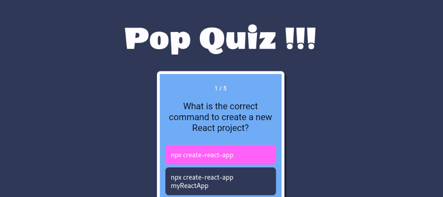

# Pop Quiz!!!

*Pop Quiz!!!* is a responsive and interactive trivia application developed in **React JS**

## Play the game!

## React JS Technologies Utilized
* Components
* useState and useContext hooks
* Passing data via Context
* onClick event handler functions

## Features
* Responsive design
* Interactive interface
* Question and score counters
* Elegant colour theme
* Fun React JS trivia

## Quiz Questions
The trivia question were sourced from: [W3Schools React Quiz](https://www.w3schools.com/react/react_quiz.asp)

## Reference Tutorials

* [Chris Blakely: React Quiz App Tutorial](https://www.youtube.com/watch?v=Lya-qYiDqIA)

* [Pedro Tech: Coding a Quiz App in React JS](https://www.youtube.com/watch?v=8LNb18ibNGs)

* [Learn ReactJS by Building 5 Projects](https://codedamn.com/learn/reactjs-projects#buy)
* Random forum posts on [Stack Overflow](https://stackoverflow.com/questions/tagged/reactjs)
